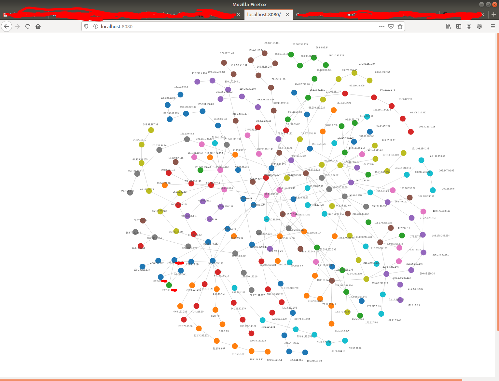
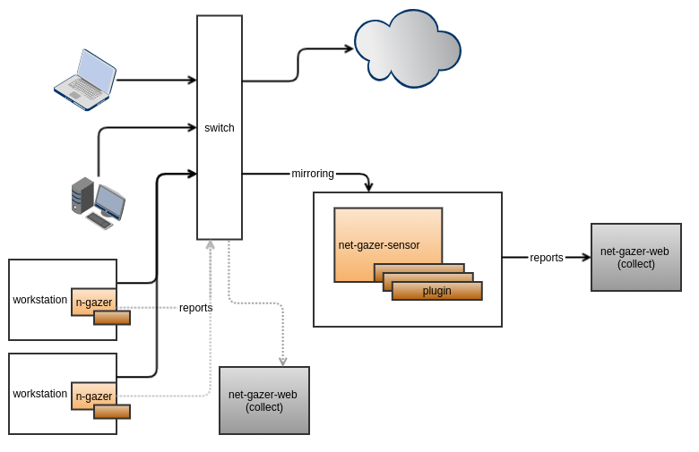
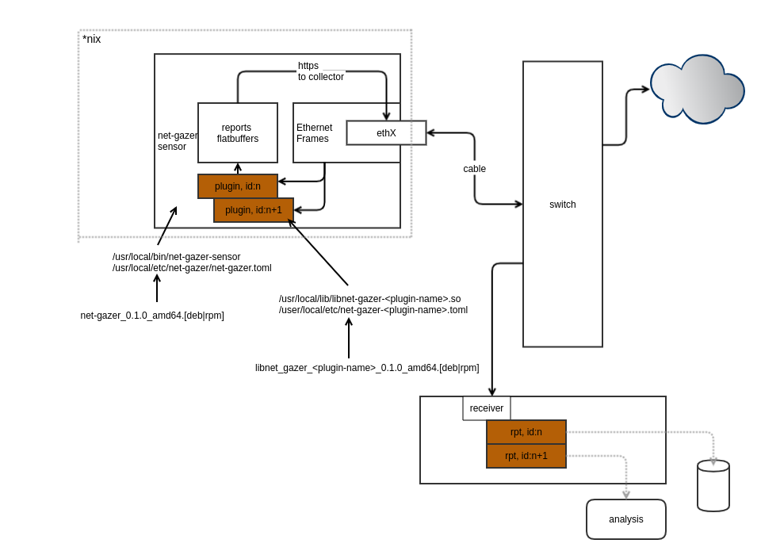

# "_net-gazer_" - network connection capture and analysis daemon 

## Goals
Design daemon that seats on gateway and passively intercepts traversing traffic, detecting SYN and SYN+ACK handshake portion. Reads remote IP and attempts to traceroute to remote host, capturing hops.  

Captured data can be:
+ graphed
+ geoiplocation enriched
+ from elapsed time between SYN and SYN-ACK derive network performance
+ capturing SACK (tcp retransmits) - derive network quality
+ visualize internal network communication
+ visualize inbound communication attempts
+ many other things

+ [traceroute: VPN box, with no VPN server running](./docs/use-case-vpn-host-with-no-vpn-running.md) 

<br/>

 data-collector part..

## TODOs
+ geoiplocation - move to another process
+ traceroute  
  + udp
  + icmp
  + tcp

## Graphed http sessions, originated from browser



## Deployment



## Architecture



## Components
1. [net-gaser-sensor](https://github.com/soleinik/net-gazer-sensor)
2. net-gazer-plugin
  * [demo](https://github.com/soleinik/net-gazer-plugin-demo)

  * [traceroute](https://github.com/soleinik/net-gazer-plugin-traceroute)
3. collector [net-gazer-web](https://github.com/soleinik/net-gazer-web)
4. redisgraph db [docker-compose](https://github.com/soleinik/net-gazer-web/blob/master/docker-compose.yml)


## how I run it...

1. build net-gazer-sensor 
```
$ cargo deb
```
install [cargo-deb](https://crates.io/crates/cargo-deb) as 
```
$ cargo install cargo-deb
```
2. install net-gazer-sensor (plugins deb is configured for dependency on net-gazer)
``` 
# dpkg -i ./target/debian/net-gazer_0.1.0_amd64.deb
```
3. stop daemon (b/c we will run it from cli)
```
# systemctl stop net-gazer
```
4. build plugin (from plugin repo build deb and install with dpkg)

5. build and run net-gazer-web
```
$ cargo run
```
6. with docker-compose bring up redisgraph 
```
$ docker-compose up
```
7. run net-gazer-sensor (it will discover deployed plugin)
```
$ cargo run -- -vv
```
8. Create some network traffic 

9. I use "redisinsight" to check graph (cypher query)
```
MATCH (n:hop) return n
```
to see 5 "neighbour" hopes
```
MATCH (a:hop{ip:'192.168.<your>.<ip>'})-[next*1..5]->(ancestors) RETURN a, ancestors
```
10. to remove everything (ofter done)
```
# apt-get purge net-gazer
```


## To run (cli help)
root is needed to run (./.cargo/config)
```
$ cargo run [-- --help]

$ cargo run -- -i eth0 -v

```

## Configuration file search order
```
./etc/net-gazer/net-gazer.toml
/usr/local/etc/net-gazer/net-gazer.toml
/etc/net-gazer/net-gazer.toml
```

## Help
```
cargo run -- --help

Running `sudo -E target/debug/net-gazer --help`
net-gazer 0.1.0
network connection capture and analysis daemon

USAGE:
    net-gazer [FLAGS] [OPTIONS]

FLAGS:
    -h, --help         Prints help information
    -V, --version      Prints version information
    -v, --verbosity    Verbose mode (-v(info), -vv(debug), -vvv(trace), etc.)

OPTIONS:
    -c, --config <config-path>    configuration file [env: NG_CONFIG=]
    -i, --iface <iface>           target network interface [env: NG_IFACE=]
